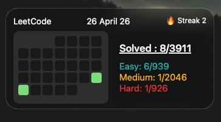

# 🚀 LeetCode Dashboard Widget (DESKTOP)

A **beautiful glassmorphism LeetCode widget** for macOS built using **Übersicht**.  
Track your **monthly activity, streak, and problem stats** directly on your desktop.

---

## ✨ Features

- 📅 Monthly submission calendar (GitHub-style heatmap)
- 🔥 Current streak tracking
- 📊 Problem stats (Easy / Medium / Hard / Total)
- 🎨 Glassmorphism UI (macOS native feel)
- ⚡ Smooth animations
- 🔄 RealTime Update

---

## 🖥 Preview



---

## 🛠 Requirements

- macOS
- Übersicht installed

Download Übersicht: https://tracesof.net/uebersicht/

---

## 📦 Installation

### 1. Install Übersicht

Download and install Übersicht, then launch it.

---

### 2. Add the Widget File

1. Download the `leetcode.jsx` file from this repository  
2. Move it to your Übersicht widgets directory:

```bash
~/Library/Application Support/Übersicht/widgets/
```

3. Refresh or restart Übersicht

The widget should now appear on your desktop 🎉nd Paste "leetcode.jsx" inside the folder and refresh or restart the Übersicht

---

### 3. Configure Username

Open the widget file:

```js
const leetcodeUsername = "YOUR_USERNAME";
```

Replace with your LeetCode username.

---

### 4. Done ✅

Übersicht will automatically load the widget on your desktop.

---

## 🔌 API Used

This project uses the **Alfa LeetCode API** for fetching user data.

Special thanks to **@alfaarghya** for providing and maintaining this API.

- 📡 Base API: `https://alfa-leetcode-api.onrender.com/{username}`  
  → Calendar data & streak

- 📊 Profile API: `https://alfa-leetcode-api.onrender.com/{username}/profile`  
  → Problem stats (Easy / Medium / Hard / Total)

📖 Documentation:  
https://github.com/alfaarghya/alfa-leetcode-api

---

## 🎨 Customization

You can easily tweak:

- 📍 Position  
```js
const widgetLeft = 15;
const widgetTop = 380;
```

- 📏 Size  
```js
const widgetWidth = 317;
const widgetHeight = 140;
```

- 🎨 Colors & UI (inside `css` styles)

---

## ⚠️ Notes

- API may occasionally be slow (free hosting)
- Data refreshes every 1 hour to avoid rate limits
- If widget fails → wait or restart Übersicht

---

## 🤝 Contributing

Feel free to fork and improve this widget!

---

## ⭐ Support

If you like this project:
- ⭐ Star the repo
- 🍴 Fork it

---

## 📄 License

MIT License

---

### 💡 Built for developers who grind on LeetCode daily.
